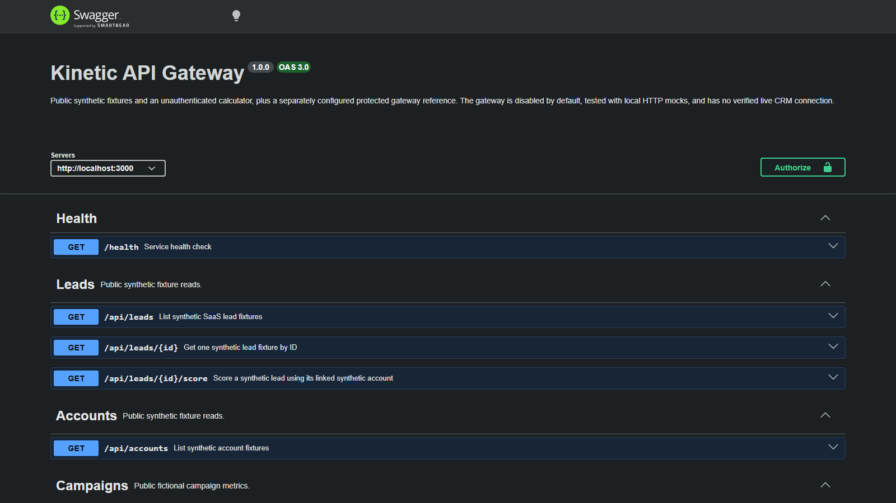
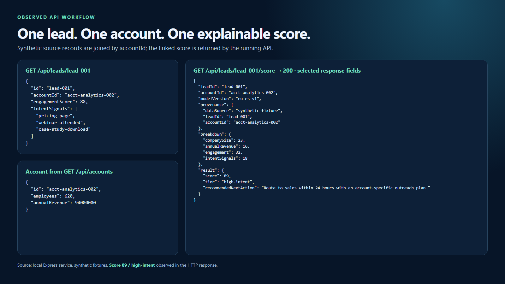
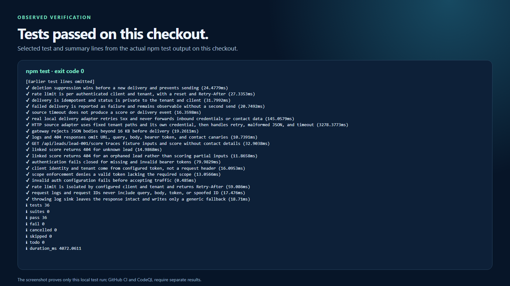

# Kinetic API Gateway

Synthetic B2B SaaS reference API for **traceable, explainable lead scoring** and a protected integration contract.

This is a demonstration service. The public resource endpoints use fictional fixtures; public `POST /api/score` accepts caller-provided inputs without authentication. The protected `/gateway/v1` integration is configured separately and tested against local HTTP mocks; it is not a verified live CRM connection. The bundled names, email addresses, and campaign metrics are fictional. Do not submit real customer data to a public instance.

> **What this repo proves**
>
> A small, documented API can connect a lead to its account, expose how a score was calculated, and exercise a guarded integration contract before a team connects real systems.

## Project Overview

| Attribute | Detail |
| --- | --- |
| **Runtime** | Node.js 20+ |
| **Framework** | Express |
| **API Style** | REST + OpenAPI / Swagger UI |
| **Domain** | B2B SaaS Revenue Operations |
| **Sample Data** | 3 accounts, 5 leads, 4 campaigns |
| **Scoring Inputs** | Company size, revenue, engagement, intent signals |
| **Operational Focus** | Linked fixture scoring and a mock-tested protected gateway reference |

---

## Service Architecture

```text
GET /api/leads, /api/accounts, /api/campaigns -> synthetic fixtures
POST /api/score -> validates caller-supplied fields -> score and recommendation text
GET /api/leads/:id/score -> fixture lead + linked account -> inputs, components, score
/gateway/v1 -> separately configured client/tenant/scopes -> HTTP source and signed delivery
```

`POST /api/score` remains a stateless public calculator. `GET /api/leads/:id/score` is the reproducible lead-to-account example. The protected gateway has a separate client and data boundary and is disabled by default. See the [architecture diagrams](./architecture-diagrams.md) and [integration contract](./docs/integration-contract.md).

### Core Components

| Component | Purpose | Key Files |
| --- | --- | --- |
| `app` | Middleware, routing, docs, 404 handling, centralized errors | `src/app.js`, `src/server.js` |
| `routes` | Endpoint-level request handling | `src/routes/*.js` |
| `data` | Realistic B2B SaaS sample records | `src/data.js` |
| `scoring` | Transparent lead scoring and recommendation logic | `src/utils/scoring.js` |
| `gateway` | Client/tenant checks, source adapter, signed delivery, local status | `src/gateway/*.js` |
| `docs` | OpenAPI, integration, privacy, and architecture contracts | `docs/` |
| `tests` | Fixture API and protected-boundary checks | `tests/` |

---

## API Surface

| Method | Endpoint | Purpose |
| --- | --- | --- |
| `GET` | `/health` | Returns API status, uptime, timestamp, and service name |
| `GET` | `/api/leads` | Returns B2B SaaS lead records |
| `GET` | `/api/leads/:id` | Returns one lead or a clean 404 response |
| `GET` | `/api/leads/:id/score` | Joins one fictional lead to its account and explains the score |
| `GET` | `/api/accounts` | Returns company / account records |
| `GET` | `/api/campaigns` | Returns fictional campaign metrics |
| `POST` | `/api/score` | Scores a lead based on fit and buying intent |
| `GET` | `/docs` | Serves Swagger UI from the OpenAPI spec |
| `GET` | `/gateway/v1/leads/:id/score` | Protected read-through score from a configured source |
| `POST` | `/gateway/v1/deliveries` | Protected, idempotent signed score-event delivery request |
| `GET` | `/gateway/v1/deliveries/:id` | Protected local delivery status lookup |
| `DELETE` | `/gateway/v1/leads/:id` | Optional source-owned deletion request; disabled by default |

---

## Business Problem

Revenue teams often have engagement data in marketing systems, firmographic context in CRM records, and campaign performance in disconnected reporting layers. That fragmentation slows sales response, reduces prioritization quality, and makes it harder for platform or digital leaders to turn web activity into actionable revenue workflows.

## Solution

Kinetic API Gateway demonstrates a compact API that:

- exposes synthetic leads, accounts, and campaign data through a REST surface
- scores caller-provided inputs or a linked fictional lead and account with transparent rules
- translates buying signals into next-step sales recommendations
- documents the contract with OpenAPI for easier onboarding and integration
- exercises client/tenant scopes, consent, deletion, and signed delivery against local HTTP mocks

---

## Scoring Model

### Inputs

| Input | Role in Score |
| --- | --- |
| `companySize` | Measures target-account fit for mid-market and enterprise segments |
| `annualRevenue` | Approximates budget maturity and commercial capacity |
| `engagementScore` | Reflects behavioral intensity across the buying journey |
| `intentSignals` | Captures explicit commercial actions such as pricing or demo interest |

### Intent Signal Weights

```text
high:   pricing-page, demo-request
medium: webinar-attended, case-study-download
low:    newsletter-click, homepage-return-visit, ad-click
```

### Tier Mapping

```text
0-39   = cold
40-69  = warm
70-84  = qualified
85-100 = high-intent
```

---

## Example Score Request

```json
{
  "companySize": 850,
  "annualRevenue": 128000000,
  "engagementScore": 91,
  "intentSignals": [
    "pricing-page",
    "webinar-attended",
    "case-study-download"
  ]
}
```

## Example Score Response

```json
{
  "score": 94,
  "tier": "high-intent",
  "explanation": [
    "High engagement score indicates strong buying interest.",
    "Pricing page visit is a strong commercial intent signal.",
    "Company size fits enterprise target profile.",
    "Revenue profile suggests budget capacity for platform investment."
  ],
  "recommendedNextAction": "Route to sales within 24 hours with an account-specific outreach plan."
}
```

## Traceable Fixture Example

`lead-001` links to `acct-analytics-002` in the fictional fixtures. The endpoint derives company size and revenue from that account, engagement and intent signals from the lead, and shows each score contribution. It does not return the lead's name or email.

```powershell
Invoke-RestMethod -Uri http://localhost:3000/api/leads/lead-001/score
```

Expected core fields:

```json
{
  "leadId": "lead-001",
  "accountId": "acct-analytics-002",
  "modelVersion": "rules-v1",
  "provenance": {
    "dataSource": "synthetic-fixture",
    "leadId": "lead-001",
    "accountId": "acct-analytics-002"
  },
  "inputs": {
    "companySize": 620,
    "annualRevenue": 94000000,
    "engagementScore": 88,
    "intentSignals": ["pricing-page", "webinar-attended", "case-study-download"]
  },
  "breakdown": {
    "companySize": 23,
    "annualRevenue": 16,
    "engagement": 32,
    "intentSignals": 18
  },
  "result": { "score": 89, "tier": "high-intent" }
}
```

The actual response also includes the recommendation and explanation. The [OpenAPI example](./docs/openapi.yaml) contains every field. Campaign records are fictional context, not an attribution or reporting feed.

---

## Getting Started

### Prerequisites

- Node.js 20+
- npm 10+

### Setup

```bash
# 1. Clone the repo
git clone https://github.com/mizcausevic-dev/kinetic-api-gateway.git
cd kinetic-api-gateway

# 2. Install dependencies
npm ci

# 3. Create local environment file
cp .env.example .env

# 4. Start the API
npm start
```

On Windows PowerShell in this checkout:

```powershell
Set-Location 'C:\Users\chaus\dev\repos\kinetic-api-gateway'
$env:PUPPETEER_SKIP_DOWNLOAD = '1'
npm.cmd ci
if (-not (Test-Path -LiteralPath '.env')) { Copy-Item -LiteralPath '.env.example' -Destination '.env' }
npm.cmd start
```

The copied environment file keeps the protected gateway disabled. Do not add credentials unless you have an authorized source and destination for the protected contract.

Swagger UI is available at `http://localhost:3000/docs`.

In a second PowerShell terminal, check the service and submit the example score request:

```powershell
curl.exe http://localhost:3000/health
$body = '{"companySize":850,"annualRevenue":128000000,"engagementScore":91,"intentSignals":["pricing-page","webinar-attended","case-study-download"]}'
Invoke-RestMethod -Uri http://localhost:3000/api/score -Method Post -ContentType 'application/json' -Body $body
```

The `/gateway/v1` routes return `503 gateway_disabled` with the default environment. Enabling them requires `GATEWAY_ENABLED=1` plus `GATEWAY_CLIENTS_JSON`, `GATEWAY_SOURCE_URL`, `GATEWAY_SOURCE_TOKEN`, `GATEWAY_DELIVERY_URL`, and `GATEWAY_DELIVERY_SECRET` of at least 32 UTF-8 bytes; deletion additionally requires `GATEWAY_ALLOW_DELETE=1`. Do not paste credentials into commands, the repo, or screenshots. The local mock tests inject loopback adapters directly, while normal configured endpoints require HTTPS. The [integration contract](./docs/integration-contract.md) records paths, scopes, headers, and failure behavior.

### Run Tests

From PowerShell in the checkout:

```powershell
$env:PUPPETEER_SKIP_DOWNLOAD = '1'
npm.cmd ci
npm.cmd test
npm.cmd audit --omit=dev --audit-level=high
```

To regenerate the two PNG diagrams and three portfolio screenshots from the local source and observed API/test output, use Chrome or Edge on the same machine:

```powershell
npm.cmd run render:diagrams
npm.cmd run capture:evidence
```

The render script reads [architecture-diagrams.md](./architecture-diagrams.md). The capture script starts a loopback API, checks the linked fixture result, runs `npm test`, and writes `screenshots/01-hero.png`, `02-feature.png`, and `03-proof.png` only after its checks pass. Set `PUPPETEER_EXECUTABLE_PATH` or `CHROME_PATH` if the browser is outside the standard install paths.

---

## Request Flow

Requests pass through security headers, demo CORS, safe request logging, and bounded JSON parsing before reaching a route. The public fixture paths and protected gateway are separate. See [architecture](./docs/architecture.md), [integration contract](./docs/integration-contract.md), [privacy lifecycle](./docs/privacy-lifecycle.md), and the [diagrams](./architecture-diagrams.md).

---

## Screenshots

This repo follows the screenshot standard documented in [docs/portfolio-screenshot-standard.md](./docs/portfolio-screenshot-standard.md).

### Local Swagger UI



### Synthetic Lead-to-Account Score



This capture uses the running local API: `lead-001` resolves `acct-analytics-002` and scores 89/high-intent. It does not show a live provider or real lead.

### Local Test Evidence



This capture includes selected lines from the actual local `npm.cmd test` run, which exited 0 with 36 passing tests and 0 failures. GitHub CI and deployed behavior require separate checks.

The captures are reproducible with `npm.cmd run capture:evidence` and live in [`screenshots/`](./screenshots/).

---

## Key Design Decisions

| Decision | Rationale |
| --- | --- |
| **In-memory sample data** | Keeps the portfolio project easy to run while still demonstrating realistic business modeling |
| **Explainable scoring rules** | Makes the lead qualification logic transparent to sales, RevOps, and hiring reviewers |
| **Centralized error handling** | Produces predictable JSON failures instead of route-specific error shapes |
| **OpenAPI-backed docs** | Shows contract discipline and makes the API easy to inspect in Swagger UI |
| **Environment-driven config** | Mirrors production deployment habits without overengineering configuration |
| **Focused endpoint scope** | Emphasizes business usefulness over tutorial-style generic CRUD |

---

## What This Demonstrates

| Capability | Evidence in Project |
| --- | --- |
| **Backend engineering** | Express app structure, middleware, routing, and error handling |
| **API design** | Clean REST endpoints with documented request/response behavior |
| **Business systems thinking** | Explainable scoring inputs and next-step recommendation text |
| **Platform maturity** | OpenAPI docs, tests, environment config, and security middleware |
| **Revenue orientation** | SaaS sample data and scoring logic framed around pipeline prioritization |

---

## Security and Delivery Posture

- The public `/api` paths have no authentication. Resource reads use fictional fixtures; `POST /api/score` must receive synthetic inputs only.
- `/gateway/v1` is a separate, disabled-by-default reference surface. It identifies a client and tenant from server-configured bearer-token hashes, then enforces route scopes: `scores:read`, `deliveries:write`, `deliveries:read`, and `leads:delete`.
- The configured source owns records. The gateway reads them using its own credential, requires current `sales-prioritization` consent, and scores in memory. Inbound client credentials are not forwarded upstream.
- Outbound score events are signed with HMAC-SHA256 and sent with an idempotency key. Delivery status and deletion suppression are process-local; neither survives restart or coordinates multiple instances.
- `helmet`, centralized errors, request IDs, bounded JSON, rate limiting, OpenAPI, automated tests, GitHub Actions, CodeQL, Dependabot, and a security policy support review. These controls do not establish production readiness by themselves.

No live CRM, real-data privacy lifecycle, shared durable outbox, or deployed boundary has been verified. Keep real leads out until the [launch gates](./docs/privacy-lifecycle.md#real-data-launch-gates) are complete.

---

## Future Enhancements

- Build a provider-specific source and destination mapping with an owner, documented permissions, and a real test environment.
- Replace process-local rate limiting, delivery metadata, idempotency, and deletion suppression with shared, durable controls.
- Verify withdrawal and deletion through source, destination, caches, logs, and backups under an approved retention schedule.
- Add deployed observability, reconciliation, alerting, and rollback evidence before handling real records.

## Release and rollback

This repository has no configured production target, and no deployed gateway has been verified. The reviewable release path is to push a branch, open a pull request, pass the Node test matrix, dependency audit, and CodeQL, then inspect the actual published boundary if a deployment is authorized.

For a local rollback, stop the server, set `GATEWAY_ENABLED=0` in the untracked `.env`, and restart with `npm.cmd start`; `/gateway/v1` then returns `503 gateway_disabled` while public synthetic examples remain available. To revert a published code change, create a revert commit and review it through the same CI path before deployment. Source deletion and accepted delivery events cannot be undone by rolling back this repository; real-data rollout requires its own provider-specific recovery plan.

---

## Tech Stack


### Portfolio Links

- [LinkedIn](https://www.linkedin.com/in/mirzacausevic)
- [Skills Page](https://mizcausevic.com/skills/)
- [Medium](https://medium.com/@mizcausevic)
- [GitHub](https://github.com/mizcausevic-dev)

---

*Part of [mizcausevic-dev's GitHub portfolio](https://github.com/mizcausevic-dev), demonstrating backend architecture, SaaS revenue workflow thinking, and API delivery practices.*
