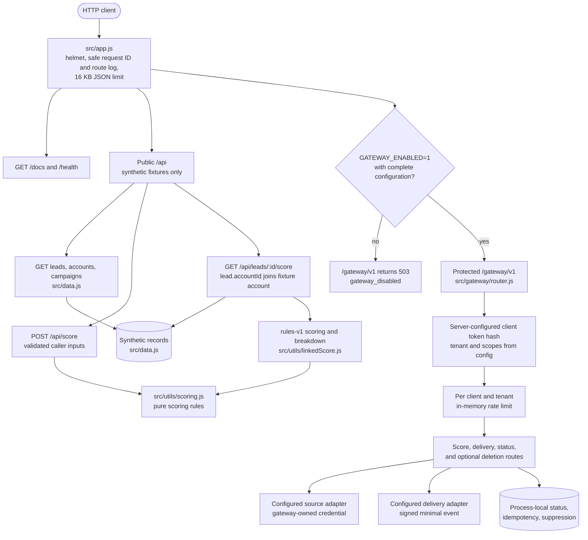
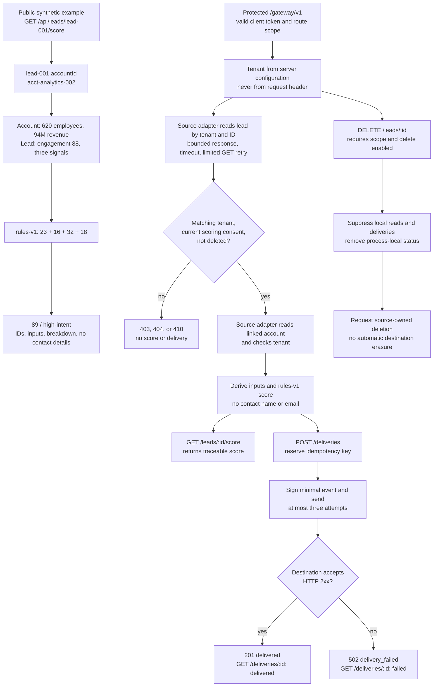

# Kinetic API Gateway: architecture diagrams

These diagrams describe the source in `src/`. `request-flow.png` and `scoring.png` are generated from the Mermaid blocks below with `npm run render:diagrams` using the pinned Mermaid CLI and a local Chrome or Edge browser.

The public API uses fictional fixtures. The protected gateway is disabled by default and has only a versioned HTTP reference contract. Neither diagram represents a verified CRM integration or production data lifecycle.

## Request flow and trust boundaries

## Linked scoring and protected delivery

