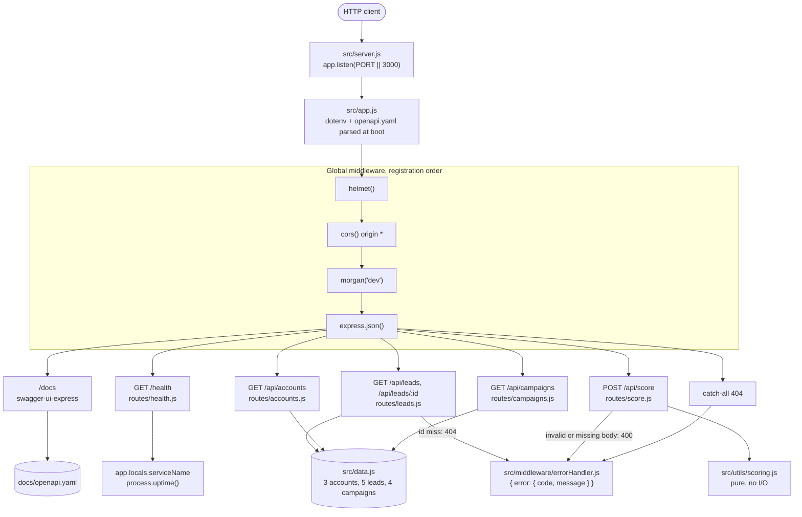
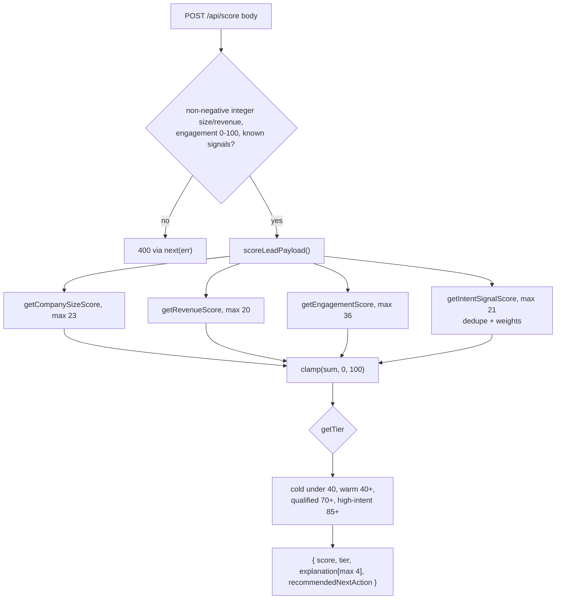

# Kinetic API Gateway: architecture diagrams

Source of truth: `src/`. In-memory, no auth, no DB. GitHub renders the Mermaid blocks below natively.

`request-flow.png` and `scoring.png` are snapshots from before the scoring validation fix. The Mermaid diagrams below describe the current source.

## Request flow

## POST /api/score internals

